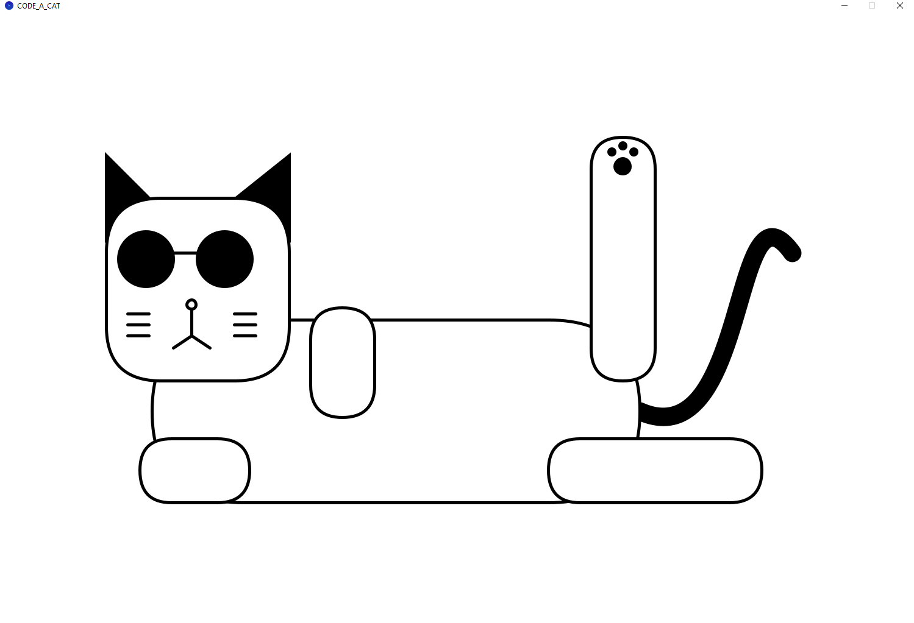

## Desenho de um Gato Iterativo Utilizando Processing

Este projeto consiste em um código em Processing para desenhar um gato de forma iterativa. Para visualizar o desenho, é necessário ter o Processing instalado em seu computador. Basta abrir o código proposto no Processing e executá-lo para visualizar a imagem do gato.

A iteração no desenho do gato é realizada através da alteração do tamanho do corpo, pernas, óculos e ativando o modo "durão" do gato. Isso é feito alterando os valores das variáveis no código:

- `bodyWidth`: controla a largura do corpo do gato.
- `legWidth`: determina a largura das pernas do gato.
- `glassesSize`: define o tamanho dos óculos do gato.
- `badassCat`: uma variável booleana que, ao ser alterada de `false` para `true`, ativa o modo "durão" do gato.

Ao ajustar esses parâmetros, é possível modificar o visual do gato conforme desejado.

Para experimentar diferentes configurações e ver o resultado visual instantâneo, basta modificar os valores das variáveis mencionadas e executar o código novamente.

Esperamos que aproveite explorando as diferentes iterações deste desenho de gato no Processing!

